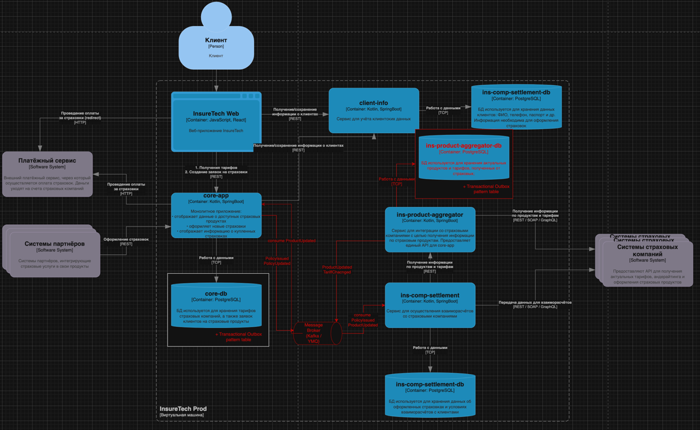
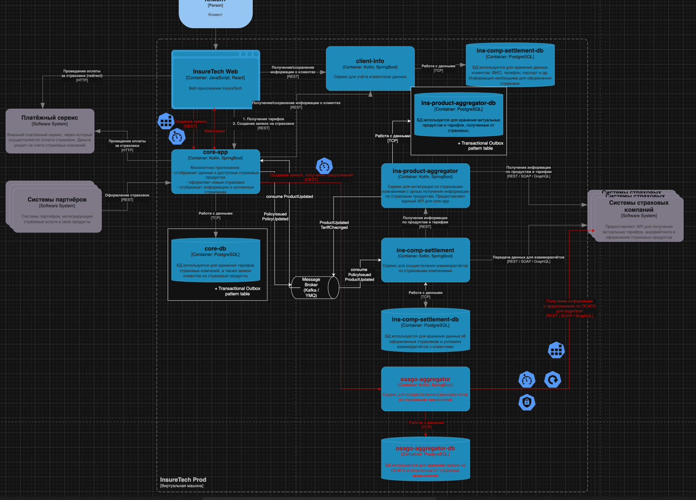

# О компании
Компания InsureTech предоставляет агрегационные услуги в сфере страхования. Она работает с частными и корпоративными клиентами:
частным клиентам компания предлагает удобный сайт для подбора и оформления страховок,
корпоративным клиентам и партнёрам предоставляет API для интеграции страховых услуг в их продукты.

Сейчас основной продукт InsureTech — это страхование жизни.

# Проблемы компании
Компания успешно запустила MVP своего приложения и планирует активно развиваться дальше. Всё бы хорошо, но приложение столкнулось со всеми классическими проблемами быстрого роста:
- Сайт медленно загружает страницы. Когда нагрузка на приложение повышается, пользователи массово жалуются на то, что страницы грузятся по несколько минут или не загружаются вообще. При этом максимально зафиксированная нагрузка на запросы поиска составила 50 RPS, а на запросы оформления — 10 RPS. Такое положение дел плохо влияет на показатели NPS и retention.
- Нарушается SLA для B2B-клиентов. Менеджеры уже неоднократно получали сообщения от партнёров, что SLA API не соответствует заявленному. В ходе изучения таких инцидентов выяснилось, что в эти периоды количество запросов от одного из партнёров кратно возрастало. Оно достигало суммарно 250 RPS на все вызываемые операции. По сути, один из партнёров «сжирал» все ресурсы приложения. С этим партнёром изначально договорились, что нагрузка не будет превышать 20 RPS.
- Приложение падает. InsureTech несколько раз столкнулась с проблемой недоступности приложения. Команда реагировала на проблему очень медленно, поскольку узнавала о ней от пользователей. Каждый час простоя сервис несёт финансовые убытки — примерно 500 тысяч рублей. Также бизнес несёт репутационные потери: в СМИ выходят негативные публикации, у сервиса низкие показатели удовлетворённости пользователей, а некоторые партнёры уже заявили о нежелании продлевать сотрудничество.

InureTech планирует в ближайшее время провести большую рекламную кампанию. Ожидается существенный прирост пользователей.

# Задание 1. Проектирование технологической архитектуры

# Задание 2. Динамическое масштабирование контейнеров
## Часть 1. Динамическая маршрутизация на основании показателей утилизации памяти
Для демонстрации работы скейлинга подов помимо HPA по памяти пришлось также сделать настройку и по утилизации CPU, так как не удалось с помощью нагрузки запросами добиться увеличения потребления памяти выше 75%.
После настройки HPA по CPU (манифест hpa-scaletestapp.yaml, утилизация CPU 70%) и запуска locust:

Дашборд k8s:

## Часть 2. Динамическая маршрутизация на основании показателей количества запросов в секунду
Манифест [hpa-scaletestapp-rps.yaml](Task02/hpa-scaletestapp-rps.yaml)

Дашборд работы locust

**По результатам настройки**:
- Prometheus и Prometheus Adapter установлены, настроен job `scaletestapp` и правило преобразования метрики `http_requests_total` в `http_requests_per_second`
- HPA по RPS сконфигурирован и ссылается на эту метрику
- В локальном стенде Minikube custom‑metrics API не показывает ресурс `http_requests_per_second` (список `resources` пустой), поэтому показать фактический скейлинг именно по RPS не удалось, но конфигурация полного контура приведена».

# Задание 3. Переход на Event-Driven архитектуру
 [Анализ проблем и рисков](Task03/InsureTech_Event_Driven_Analysis.md)
 
Изменения в C4-диаграмме:
- добавлен message broker (Kafka / YMQ)
- `ins-product-aggregator` продюсит события `ProductUpdated`, `TariffChanged`
- `core-app` продюсит события `PolicyIssued`, `PolicyUpdated`
- `core-app` подписан на событие `ProductUpdated` для обновления своего кэша
- `ins-comp-settlement` подписан на события `PolicyIssued` и `ProductUpdated`
- удалено REST взаимодействие `core-app` → `ins-product-aggregator` на получение всех продуктов  
- удалено REST взаимодействие `ins-comp-settlement` → `core-app` на получение всех оформленных полисов за день
- добавлена БД PostgreSQL `ins-product-agregator-db` для хранения актуальных продуктов и тарифов от страховых компаний (добавлен паттерн Transactional Outbox, (т.к. сервис `ins-product-agregator` продюсит события )
- добавлен паттерн Transactional Outbox в БД `core-db` (т.к. сервис `core-app` продюсит события)

Измененная контейнерная диаграмма:

# Задание 4. Проектирование продажи ОСАГО
## База данных
Для нового сервиса `osago-aggregator` нужна БД `osago-aggregator-db`
- для поддержки опроса страховых в течение времени без потери состояния
- для того, чтобы иметь возможность повторного опроса страховых (ретраев)
- для того, чтобы иметь возможность хранить логи и расследовать инциденты

В БД будут хранениться данные:
- заявки на ОСАГО, отправленные в страховые:
  - id заявки в core‑app
  - список страховых компаний, куда отправлены запросы
  - внутренние id заявок от страховых компаний (для получения ответа на запросы)
  - статусы запросов, временные метки
- полученные предложения:
  - премия, условия, срок действия оффера
  - ссылка на исходную заявку и страховую

## API osago-aggregator для core-app
С точки зрения `core‑app` удобно сделать асинхронное API:
- **POST /osago/requests**
  - Для чего ручка: агрегатор создаёт запись заявки, инициирует запросы во все страховые.
  - Вход: данные автомобиля, водителя и т.п.
  - Выход: requestId (внутренний id агрегатора) + список страховых, по которым стартовал процесс
- GET /osago/requests/{requestId}/offers
  - Для чего ручка: возвращает текущий список полученных предложений + статусы по остальным («ожидаем/ошибка/таймаут»)

`core‑app` может опрашивать `osago-aggregator` раз в 1–2 секунды, пока:
- не собраны все ответы
- не истек таймаут 60 секунд

Для осуществления вывода информации по предложениям страховых на веб-клиент, необходимо:
- `InsureTech Web` -> `core-app` POST /osago/requests с данными о водителе
- `core-app` создает свою сущность, дергает `osago-aggregator` через POST /osago/requests и возвращает полученный `requestID` на фронт
- между браузером и `core-app` создаем WebSocket и при каждом обновлении списка предложений от страховой `core-app` отправляет сообщение в этот канал
- фронт обновляет таблицу предложений по мере их получения

## Применение паттернов отказоустойчивости
- Timeout
  - `core‑app` → `osago-aggregator` таймаут на запросы 1-2 секунды на POST / GET запросы
  - и по всем остальным вызовам вниз по цепочке от фронта до вызова страховых
- Retry
  - `osago-aggregator` → API страховых компаний - 2-3 retry с общим таймаутом 60 секунд (если таймаут, то статус = "нет ответа")
- Circuit Breaker
  - есть смысл ставить только для вызова страховых (внешнего ресурса) во избежание ситуации массового падения API некоторых компаний (устанавливать по отдельным компаниям)
- Rate Limit
  - `InsureTech Web` -> `core-app` на запросы по созданию заявок в целях защиты от ботов/атак
  - `osago-aggregator` → API страховых компаний (чтобы не превысить лимиты по конкретным страховым)

`osago-aggregator` не должен хранить состояние внутри сервиса, только в своей БД (т.к. сервис работает в нескольких инстансах)
**Rate limiting** и **circuit breaker** лучше организовать на уровне API Gateway / Balancer по той же причине

[Измененная диаграмма контейнеров](Task04/InsureTech_C4_container-diagram-osago-to-be.drawio)

# Задание 5. Проектирование GraphQL API
Ключевые ресурсы и операции в Swagger:
- `GET /clients/{id}` - информация о клиенте
- `GET /clients/{id}/documents` - список документов клиента
- `GET /clients/{id}/relatives` - информация о родственниках клиента

В GraphQL это можно собрать в один корневой запрос `client(id)` с вложенными полями `documents` и `relatives`. 

Клиент (frontend или core‑app) сам решает, какие поля ему нужны, и делает один запрос вместо трёх.

[GraphQL‑схема](Task05/client-info.graphql)