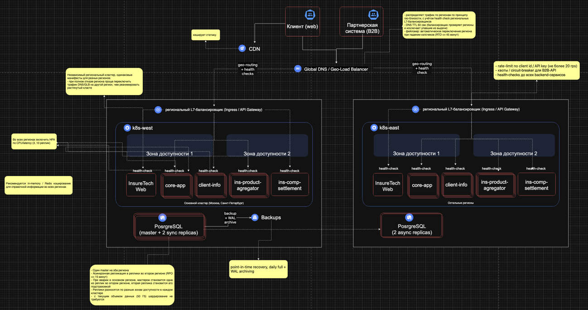
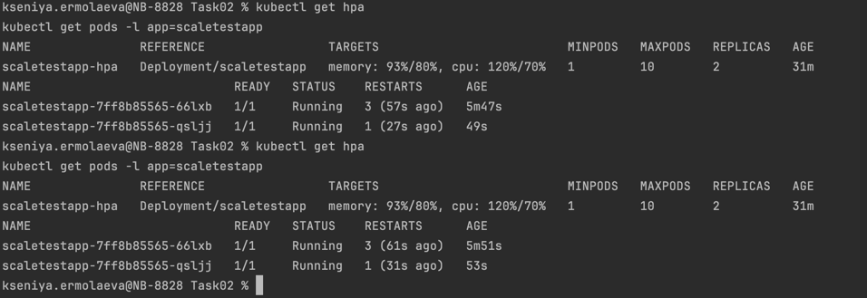
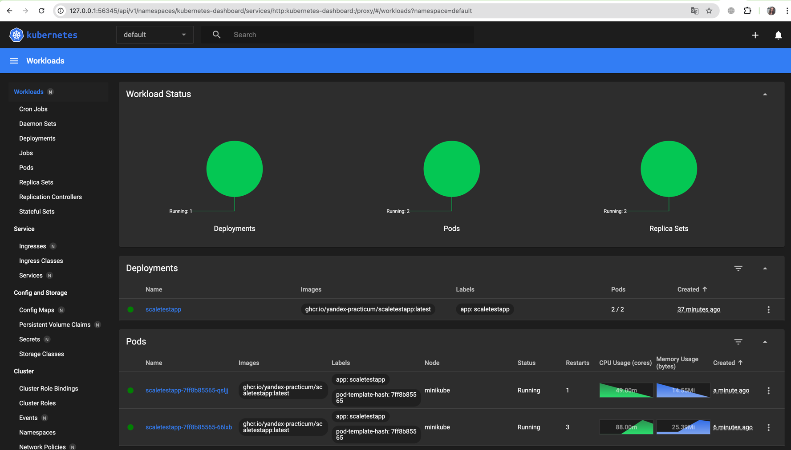
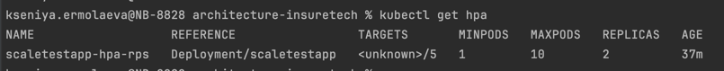
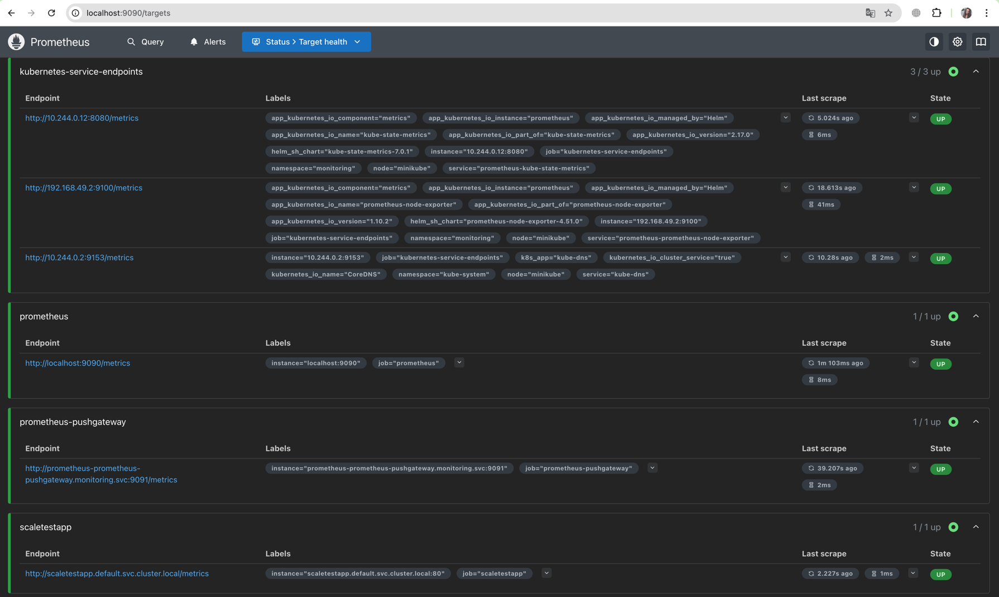
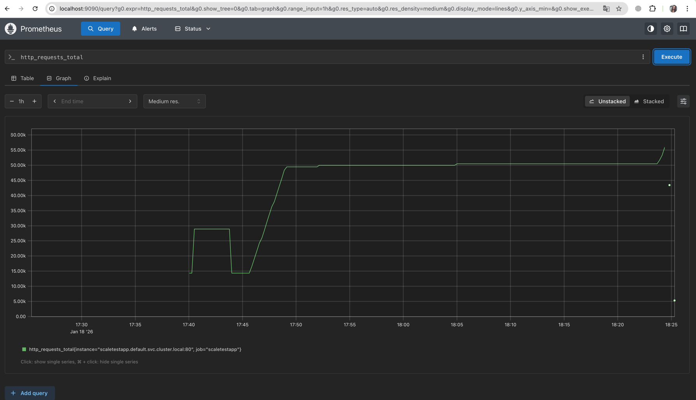
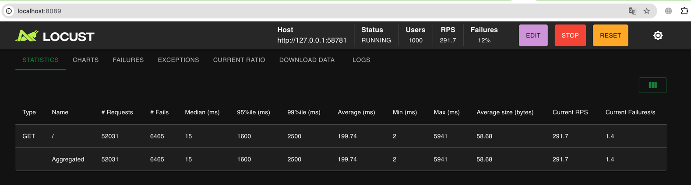
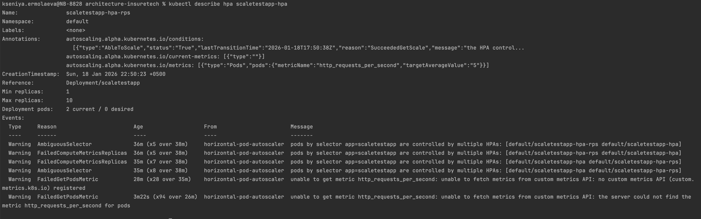

# О компании
Компания InsureTech предоставляет агрегационные услуги в сфере страхования. Она работает с частными и корпоративными клиентами:
частным клиентам компания предлагает удобный сайт для подбора и оформления страховок,
корпоративным клиентам и партнёрам предоставляет API для интеграции страховых услуг в их продукты.

Сейчас основной продукт InsureTech — это страхование жизни.

# Проблемы компании
Компания успешно запустила MVP своего приложения и планирует активно развиваться дальше. Всё бы хорошо, но приложение столкнулось со всеми классическими проблемами быстрого роста:
- Сайт медленно загружает страницы. Когда нагрузка на приложение повышается, пользователи массово жалуются на то, что страницы грузятся по несколько минут или не загружаются вообще. При этом максимально зафиксированная нагрузка на запросы поиска составила 50 RPS, а на запросы оформления — 10 RPS. Такое положение дел плохо влияет на показатели NPS и retention.
- Нарушается SLA для B2B-клиентов. Менеджеры уже неоднократно получали сообщения от партнёров, что SLA API не соответствует заявленному. В ходе изучения таких инцидентов выяснилось, что в эти периоды количество запросов от одного из партнёров кратно возрастало. Оно достигало суммарно 250 RPS на все вызываемые операции. По сути, один из партнёров «сжирал» все ресурсы приложения. С этим партнёром изначально договорились, что нагрузка не будет превышать 20 RPS.
- Приложение падает. InsureTech несколько раз столкнулась с проблемой недоступности приложения. Команда реагировала на проблему очень медленно, поскольку узнавала о ней от пользователей. Каждый час простоя сервис несёт финансовые убытки — примерно 500 тысяч рублей. Также бизнес несёт репутационные потери: в СМИ выходят негативные публикации, у сервиса низкие показатели удовлетворённости пользователей, а некоторые партнёры уже заявили о нежелании продлевать сотрудничество.

InureTech планирует в ближайшее время провести большую рекламную кампанию. Ожидается существенный прирост пользователей.

# Задание 1. Проектирование технологической архитектуры

# Задание 2. Динамическое масштабирование контейнеров
## Часть 1. Динамическая маршрутизация на основании показателей утилизации памяти
Для демонстрации работы скейлинга подов помимо HPA по памяти пришлось также сделать настройку и по утилизации CPU, так как не удалось с помощью нагрузки запросами добиться увеличения потребления памяти выше 75%.
После настройки HPA по CPU (манифест hpa-scaletestapp.yaml, утилизация CPU 70%) и запуска locust:

Дашборд k8s:

## Часть 2. Динамическая маршрутизация на основании показателей количества запросов в секунду
Манифест [hpa-scaletestapp-rps.yaml](Task02/hpa-scaletestapp-rps.yaml)

Дашборд работы locust

**По результатам настройки**:
- Prometheus и Prometheus Adapter установлены, настроен job `scaletestapp` и правило преобразования метрики `http_requests_total` в `http_requests_per_second`
- HPA по RPS сконфигурирован и ссылается на эту метрику
- В локальном стенде Minikube custom‑metrics API не показывает ресурс `http_requests_per_second` (список `resources` пустой), поэтому показать фактический скейлинг именно по RPS не удалось, но конфигурация полного контура приведена».